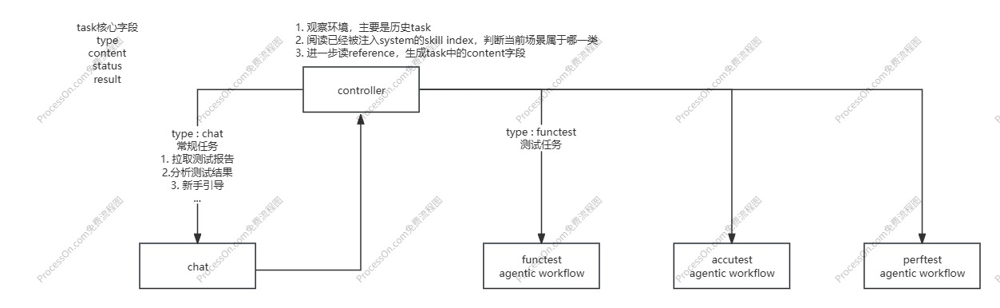

# 适用于小场景的 Gateway-Task 路由机制

## 1. 核心机制

### 1.1 设计目标
在小场景中，将 `codex_task`（做什么）、`codex_turn`（是否结束并回复用户）、`codex_runtime`（执行进度与是否继续）合并为一套轻量路由机制。

### 1.2 整体流程（流程图）


说明：本节以流程图为准，不做步骤文字化展开。

### 1.3 Task 对象

| 字段 | 含义 | 示例 |
| --- | --- | --- |
| `type` | 任务类型，区分体验类与测试类 | `normal` / `functest` |
| `content` | 执行目标，不承载复杂 planning | `针对 anthropic_ver_1 生成 headers/body/assert 并执行测试` |
| `status` | 任务状态 | `pending/running/done/failed` |
| `result` | 执行结果摘要，供下一轮观察 | `测试失败，assert_result.json 显示 code 不匹配` |

示例：
```json
{
  "type": "functest",
  "content": "针对 anthropic_ver_1 生成 headers、body、assert 并执行测试",
  "status": "failed",
  "result": "测试失败，assert_result.json 显示字段 code 不匹配"
}
```

### 1.4 Environment（中期记忆）
`environment` 记录多轮上下文，用于下一轮决策。

```json
{
  "rounds": [
    {
      "round": 1,
      "user_input": "帮我做一次 anthropic_ver_1 的功能测试",
      "task": {
        "type": "functest",
        "content": "针对 anthropic_ver_1 生成 headers、body、assert 并执行测试"
      },
      "task_status": "failed",
      "task_result": "测试失败，assert_result.json 显示字段 code 不匹配",
      "reply": "功能测试已完成，但存在失败 case。"
    }
  ]
}
```

### 1.5 Skills Index（Encyclopedia）
`skills index` 以系统提示词形式注入，用于渐进式披露和路由约束。

#### Controller Encyclopedia

---

##### Normal task
定位：强体验需求任务，通常需要立刻反馈，后续交给 `react/chat agent` 而非 workflow。

常见情况：`#历史报告查阅` `#历史报告分析` `#使用指导` `#联系人工Oncall`

**Reference**: `WorkDir/Encyclopedia/Controller/chat-task.md`

---

##### Funtest task
定位：功能测试任务。

常见情况：`#要做功能测试` `#使用昨天的配置进行测试`

**Reference**: `WorkDir/Encyclopedia/Controller/functest-task.md`

---

##### Accutest task
定位：精度测试任务。

**Reference**: `WorkDir/Encyclopedia/Controller/accutest-task.md`

---

##### Perftest task
定位：性能测试任务。

**Reference**: `WorkDir/Encyclopedia/Controller/perftest-task.md`

### 1.6 Controller 策略
1. 观察：读取 `environment` + `reference files` + 可用观察工具。
2. 决策：输出一个结构化动作（见第 3 节）。
3. 执行：将生成的任务交给对应执行单元。
4. 回写：更新 `task.status/result` 与 `environment.rounds`。

## 2. 优缺点

### 2.1 优点
- 实现与维护成本低。
- Token 消耗低，响应快。
- 通过结构化动作降低小模型自由生成带来的漂移。

### 2.2 缺点
- 扩展到复杂场景时，小模型可能出现决策变形。
- 旗舰模型效果更好但成本高、难本地部署，因此需要 teacher-student 蒸馏。

## 3. 面向小模型的 Controller RL 优化

### 3.1 训练设定
- `Teacher`：`GPT-5.2-thinking`、`Claude 4.6 Opus`
- `Student`：待定
- `训练资源`：待定

### 3.2 动作空间（将图示改为文本）

第一层：动作大类
```text
action_kind ∈ { observe, generate_task }
```

第二层：动作子类
```text
if action_kind == observe:
  subtype ∈ { read, 其他可用观察工具 }

if action_kind == generate_task:
  task_type ∈ { normal, functest, accutest, perftest }
```

第三层：动作参数
```text
if observe:
  - 指定 tool
  - 指定 args（path / object / params）

if generate_task:
  - 指定 task_content
```

统一动作 Schema：
```json
{
  "action_kind": "observe | generate_task",
  "tool": "read",
  "args": {
    "path": "var/runs/latest/functest/assert_report.txt"
  },
  "task_type": "normal | functest | accutest | perftest",
  "task_content": "根据最近一次 functest 的失败报告整理失败原因摘要，供后续回答使用"
}
```

> 说明：`observe` 时使用 `tool/args`；`generate_task` 时使用 `task_type/task_content`。

### 3.3 数据构造
分两阶段进行：`SFT warm start` -> `GRPO`。

#### 3.3.1 SFT warm start
输入（state）示例：
```json
{
  "state": {
    "user_input": "帮我看看最近一次 functest 为什么失败",
    "rounds": [
      {
        "round": 1,
        "user_input": "帮我做一次 anthropic_ver_1 的功能测试",
        "task": {
          "type": "functest",
          "content": "针对 anthropic_ver_1 生成 headers、body、assert 并执行测试"
        },
        "task_status": "done",
        "task_result": "测试失败，assert_result.json 显示字段 code 不匹配",
        "reply": "功能测试已完成，但存在失败 case。"
      }
    ],
    "available_tools": ["read", "read_current_run_task_outputs"],
    "available_task_types": ["normal", "functest", "accutest", "perftest"]
  }
}
```

输出（action）示例：
```json
{
  "action_kind": "observe",
  "tool": "read",
  "args": {
    "path": "var/runs/latest/functest/assert_report.txt"
  }
}
```

或：
```json
{
  "action_kind": "generate_task",
  "task_type": "normal",
  "task_content": "根据最近一次 functest 的失败报告整理失败原因摘要，供后续回答使用"
}
```

#### 3.3.2 GRPO
单条样本可表示为：
```json
{
  "state": { "...": "同上" },
  "teacher_action": {
    "action_kind": "observe",
    "tool": "read",
    "args": {
      "path": "var/runs/latest/functest/assert_report.txt"
    }
  },
  "sampled_actions": [
    {
      "action_kind": "observe",
      "tool": "read",
      "args": { "path": "var/runs/latest/functest/assert_report.txt" }
    },
    {
      "action_kind": "observe",
      "tool": "read",
      "args": { "path": "var/runs/latest/functest/raw_response.json" }
    },
    {
      "action_kind": "generate_task",
      "task_type": "normal",
      "task_content": "总结最近一次 functest 的失败原因"
    },
    {
      "action_kind": "generate_task",
      "task_type": "perftest",
      "task_content": "执行一次性能测试"
    }
  ]
}
```

可实现的规则化奖励（示例）：
```text
当 teacher_action.action_kind = observe 时：
1) kind_score
   - student.action_kind == teacher.action_kind -> +2.0
   - 否则 -> -2.0

2) path_score（仅 observe/read 时）
   - 路径完全一致 -> +1.0
   - 同目录但文件不一致 -> +0.4
   - 完全无关 -> 0.0

总分：reward = kind_score + path_score
```

### 3.4 为什么选 GRPO（整理）
1. 省去 `critic`，计算与显存开销更低。
2. 更适合规则化 reward（动作是否合法、工具/路径是否合理、JSON 是否可执行）。
3. 更适合同一 `state` 下多可行解并存的场景，优化目标是“组内更优”。

### 3.5 为什么做分层 RL
如果把动作拍平成一个大 `one-hot` 分类：
- 动作空间碎片化严重。
- 工具数量增长后组合爆炸。
- “先观察还是先下任务”与“具体用哪个工具”耦合。
- “生成哪类 task”与“task 内容怎么写”耦合。

分层建模可以把决策拆开，显著降低小模型学习难度。
